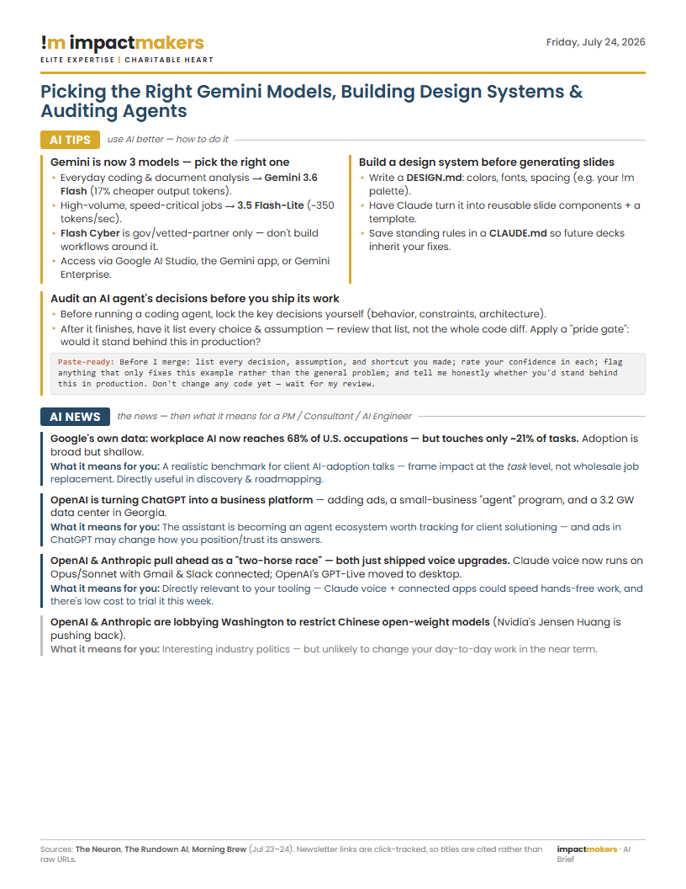

# AI Brief News Agent

A routine for **Claude Code** that turns the AI newsletters in your inbox into a single, brand-styled **one-page PDF** — split into **AI Tips** (step-by-step how-to) and **AI News** (the news + *what it means for you* as a PM / Consultant / AI Engineer). Built for the Impact Makers team as a personal-development habit.



## What you get
A one-page, Impact Makers–branded PDF (Poppins font; gold / black / dark-blue) saved to a folder of your choice, named for the day's content, e.g.
`Picking the Right Gemini Models, Building Design Systems & Auditing Agents_7_24_26.pdf`

---

## ⚠️ Before it can work: you must feed it newsletters

**The agent does not browse the web.** It only reads AI newsletters that land in one dedicated Outlook folder. So the quality of your brief depends entirely on this setup. Do these one-time steps first.

### Step 1 — Subscribe to a few AI newsletters
Pick 2–4 so there's daily material. Recommended (all free):
| Newsletter | Focus | Sign up |
|---|---|---|
| **The Neuron** | Daily AI news + a practical "AI skill of the day" | theneurondaily.com |
| **The Rundown AI** | Daily AI news + tools + how-tos | therundown.ai |
| **TLDR AI** | Short, technical AI/ML news | tldr.tech/ai |
| **Morning Brew** | General business (AI-adjacent bits only) | morningbrew.com |

> Tip: subscribe using the **email address you'll route from** (see Step 3).

### Step 2 — Create a dedicated Outlook folder
In your **work** Outlook, make a folder named exactly **`Claude AI News Recap`** (Right-click your mailbox → *Create new folder*). This is the only folder the agent reads.

### Step 3 — Route the newsletters into that folder
Choose whichever matches where you subscribed:

**A) You subscribed with your personal Outlook** — create a forwarding rule:
1. outlook.com → ⚙️ → **Mail → Rules → + Add new rule**.
2. Name it `Forward AI News`.
3. Condition **From** = your newsletter senders (add each one).
4. Action **Forward to** = your work address.
5. Save. *(New mail only; forwarding rules can't run on old mail.)*

**B) You subscribed with Gmail** — Gmail → ⚙️ **See all settings → Forwarding and POP/IMAP → Add a forwarding address** (verify it), then **Filters → Create filter** (From = the senders) → **Forward it to** your work address.

**C) You subscribed with your work email directly** — just add an inbox rule that **moves** messages from those senders into `Claude AI News Recap`.

### Step 4 — Keep them out of Junk
If a newsletter lands in Junk, right-click it → **Junk → Never block sender**, or add the sender to **Safe Senders**.
🔒 *The agent never reads your Junk folder — that's deliberate, for security — so anything stuck in Junk is invisible to it.*

---

## Technical setup (one-time)
1. **Clone this repo.**
2. **Enable the Microsoft 365 connector** in Claude (read access to mail).
3. **Install Google Chrome** (or Edge) — used to render the PDF.
4. *(Optional)* `pip install pypdf` for a one-page sanity check.
5. **Choose the folder on your computer where the PDFs will be saved.** This is a local folder on *your* machine (e.g. `Desktop\AI News & Tips`) — create it wherever you'd like your briefs to collect. Then point the agent at it: edit `OUTPUT_DIR` in `build/build_brief.py`, **or** set the `AI_BRIEF_OUTPUT_DIR` environment variable to that path.
   - *If the folder doesn't exist yet, the build script creates it automatically — but pick the location you actually want, so your PDFs don't end up somewhere unexpected.*

## Using it
Tell Claude Code:
> "Run the AI Brief routine for today."

Claude follows [`INSTRUCTIONS.md`](INSTRUCTIONS.md): reads the folder, classifies into AI Tips / AI News, writes `content/<date>.json`, and builds the PDF. To re-render an existing content file yourself:
```bash
python build/build_brief.py content/2026-07-24.json
```

**Want it to run automatically every morning?** See **[ROUTINE.md](ROUTINE.md)** — it has the copy-paste prompt and step-by-step scheduling instructions (including a ready-made `/ai-brief` command).

## Repo layout
| Path | Purpose |
|---|---|
| `INSTRUCTIONS.md` | The daily routine Claude Code follows. |
| `ROUTINE.md` | How to run it as a scheduled routine + the prompt. |
| `template/brief_template.html` | One-page layout + brand CSS. |
| `build/build_brief.py` | Renders a content JSON → branded PDF via headless Chrome. |
| `content/2026-07-24.json` | Example of the day's content. |
| `.claude/commands/ai-brief.md` | Bundled `/ai-brief` slash command. |
| `fonts/` | Poppins (SIL Open Font License) — the !m brand font. |

## Customizing
- **Reader lens:** change "PM / Consultant / AI Engineer" in `INSTRUCTIONS.md` and the template subtitle.
- **Sources:** add/remove newsletters in `INSTRUCTIONS.md` → CONFIG and in your forwarding rule.
- **Styling:** all colors/spacing/fonts live in `template/brief_template.html`.

## Brand & safety
- **Font:** Poppins only (the !m standard brand font). Aptos is reserved for email signatures.
- **Colors:** Gold `#D8A928` · Black `#262626` · Dark Blue `#264966` (+ supporting grays; tertiary green/terracotta/lilac).
- **Read-only mail:** the routine searches and reads mail; it never deletes, moves, or sends — and never reads Junk.

## License
Code and templates: internal Impact Makers use. Poppins font: [SIL Open Font License 1.1](fonts/).
